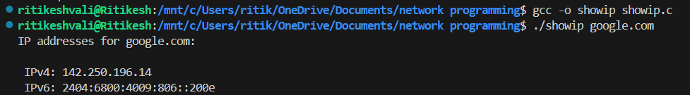

# showip

## Description

`showip.c` is a C program that displays the IP addresses for a specified host provided as a command-line argument.

## Usage

To compile the program, use a C compiler such as `gcc`:

```bash
gcc -o showip showip.c

```

To run the program, specify the host as a command-line argument:

```bash
./showip example.com
```

## Example

```bash
$ ./showip example.com
IPv4 addresses for example.com:

    93.184.216.34

IPv6 addresses for example.com:

    2606:2800:220:1:248:1893:25c8:1946
    2606:2800:220:1:248:1893:25c8:1945
```



## Common Errors

1. Windows Users

   - If you're on Windows, using WSL is a good option.
   - To run the code, use "WSL: Open Folder in WSL" option in VSCode and open the file.
   - Run the file using the above commands in terminal.

2. *Incomplete type is not allowed* error
   - In the .vscode folder, open "c_cpp_properties.json".
   - Within configurations, add defines as follows:
   ```
   "defines": [
               "__linux__",
               "__x86_64__",
               "_GNU_SOURCE"
           ],
   ```

## Contributions

Contributions are welcome! If you find any issues or have suggestions for improvements, please feel free to open an issue or submit a pull request.